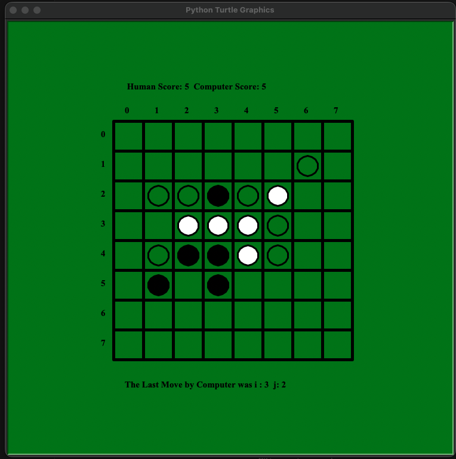

# Othello — Minimax AI

This project is a simple Othello game implemented in `Othello.py`, where you play as **Black (B)** against a computer opponent **White (W)**. The board is drawn using Python’s `turtle` graphics, while moves are entered as `(i, j)` coordinates in the terminal.  
Under the hood, the computer chooses moves using **minimax with alpha–beta pruning**, scoring positions based on disc count and available moves.

## Run

`python Othello.py`
